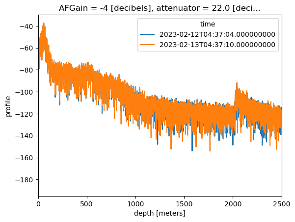

<!-- SPHINX-START-proj-desc -->
# xapres

A package for loading and processing data collected using the Autonomous phase-sensitive Radio-Echo Sounder (ApRES). 

ApRES is an ice-penetrating radar used for measuring ice-shelf basal melt rates, englacial deformation, and other englacial changes like water content. ApRES was developed by University College London and The British Antarctic Survey. 

xapres package uses [xarray](https://xarray.pydata.org/en/stable/), a package that simplifies indexing, grouping, aggregating, and plotting multi-dimensional data (like ApRES data). Using xarray in xapres simplifies the challenge of dealing with multiple measurements taken using different attenuator and gain settings, using different antenna orientations, or in different locations. xapres also simplifies many common processing steps, for example averaging chirps (i.e. stacking) stacking or resampling in time. Finally, using xarray as the basis for storage and processing of ApRES data helps when dealing with very large AprES datasets because it facilitates convenient storage in zarr stores and cloud computing. 

A key goal is to allow the loading, processing and plotting of full ApRES datasets, collected in either unattended or attended mode, with only a few lines of code. 

For example, loading raw ApRES data (stored in .dat files), performing an fft to get depth profiles and plotting can be achieved in one line of code as follows:


<!-- SPHINX-END-proj-desc -->

```
xapres.load.generate_xarray(directory='../data/thwaites/')\
    .profile.mean(dim='chirp_num')\
    .isel(attenuator_setting_pair=0)\
    .dB()\
    .plot.line(hue="time", xlim = (0, 2500));
```


 


## Installation

```
pip install xapres
```

## Usage

See the notebooks/guides directory for examples of how to use both the core processing code and how to restructure the resulting profiles and chirps into an xarray.

The most useful guide is notebooks/guides/UsingXaPRES.ipynb.

### Quick start
A common thing that you may want to do with XApRES is to gather multiple ApRES measurements, which are stored in .dat files, into one xarray. 

The fastest way to do this is:
```
# import the package
import xapres as xa
# load the chirps, perform an fft, and put them all in an xarray
directory = '../../data/sample/thwaites/'
data = xa.load.generate_xarray(directory=directory)
# stack the chirps in each burst,
profiles = data.profile.mean(dim='chirp_num')
# select one of the attenuator pairs, compute the decibels and plot
profiles.isel(attenuator_setting_pair=0).dB().plot(x='time', yincrease=False)
# compute velocities and strain rates
w = profiles.displacement_timeseries()
w.velocity.plot(y = 'bin_depth', yincrease=False, xlim = (-2, 7), ylim = (1200,0))
```

You just need to change `directory` to the location of your .DAT files and the code will search recursively through the directory and its sub-directories to find and process all the .DAT they contain. 


### Writing and loading from zarr

The package includes the capability to write data to zarr stores, which can be accessed efficiently without immediately loading all the data to disk. This is particularly useful when performing analysis in the cloud, but can be useful when inspecting the data locally too. 

For example, to lazily access (meaning that no data is downloaded immediately) some recent ApRES data from Greenland, use:

```
import xarray as xr
def reload(site):
    filename = f'gs://ldeo-glaciology/apres/greenland/2022/single_zarrs_noencode/{site}'
    ds = xr.open_dataset(filename,
        engine='zarr', 
        chunks={}) 
    return ds
A101 = reload("A101")
A103 = reload("A103")
A104 = reload("A104")
```

Alternatively, you can use a function built-in to the package which loads these data, and also adds some functionality to the xarray it returns: 

```
import xapres as xa
ds = xa.load.load_zarr()
ds
```

The dataset `ds` containing various variables, including the complex depth profile. 

### Functionality added to xarrays by XApRES

You can compute decibels from complex depth profiles using 

```
ds.profile.dB().compute()
```

You can also sonify the chirp. Because the frequencies contained in the chirps are mostly in the audible range, you can play them through the computer's speakers and hear what the ApRES data sound like:

```
ds.chirp.isel(time=300, chirp_num=0, attenuator_setting_pair=0).sonify()
```

This plays the chirp and if you set `save = True` as an input it will save the audio file as a .wav file. 

Contributions to this project are very welcome! Please feel free to contact us through github issues. 


--------

<p><small>Project based on the <a target="_blank" href="https://github.com/jbusecke/cookiecutter-science-project">cookiecutter science project template</a>.</small></p>
